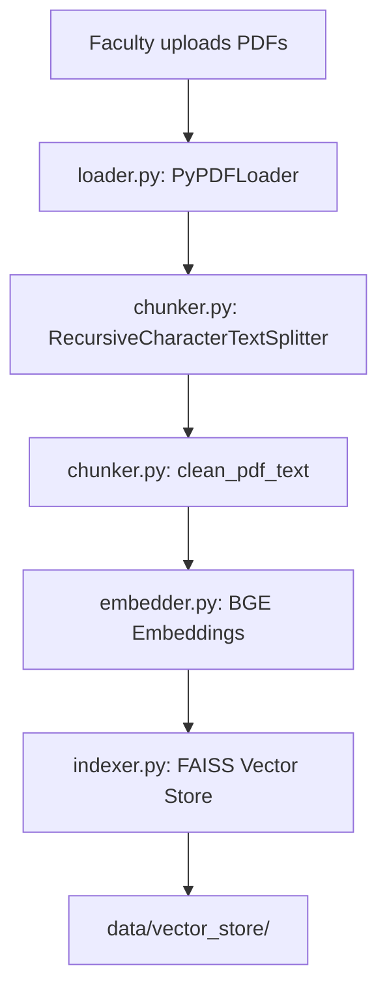
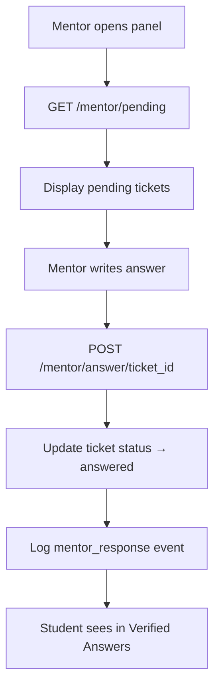

# 📘 Campus Mind — Trustworthy Educational RAG Chatbot

A **Retrieval-Augmented Generation (RAG)** based educational chatbot that answers strictly from institute-approved material with **confidence-aware decision logic**, **human-in-the-loop verification**, and **full audit traceability**.

---

## Table of Contents

- [Project Overview](#project-overview)
- [System Architecture](#-system-architecture)
- [Core Design Principles](#-core-design-principles)
- [Tech Stack](#-tech-stack)
- [Project Structure](#-project-structure)
- [Backend — Deep Dive](#-backend--deep-dive)
  - [Entry Point — `main.py`](#1-entry-point--mainpy)
  - [Configuration — `config.py`](#2-configuration--configpy)
  - [Dependencies — `dependencies.py`](#3-dependencies--dependenciespy)
  - [Ingestion Pipeline](#4-ingestion-pipeline)
  - [RAG Pipeline](#5-rag-pipeline)
  - [API Routes](#6-api-routes)
  - [Data Models & Schemas](#7-data-models--schemas)
  - [Persistence Layer — `models/db.py`](#8-persistence-layer--modelsdbpy)
  - [Audit Logging — `utils/logger.py`](#9-audit-logging--utilsloggerpy)
  - [API Endpoint Reference](#10-api-endpoint-reference)
- [Frontend — Overview](#-frontend--overview)
  - [Pages](#pages)
  - [Components](#components)
  - [API Client](#api-client)
- [Data Flow — End to End](#-data-flow--end-to-end)
  - [Ingestion Flow](#ingestion-flow-offline)
  - [Query Flow](#query-flow-runtime)
  - [Mentor Flow](#mentor-flow)
- [Installation Guide](#-installation-guide)
- [Environment Variables](#-environment-variables)
- [Deployment Strategy](#-deployment-strategy)
- [Future Improvements](#-future-improvements)

---

## Project Overview

Large Language Models are powerful — but in educational institutions, **accuracy and trust** matter more than creativity. This project implements a **retrieval-first, confidence-aware AI assistant** that:

- ✅ Answers **only** from faculty-uploaded study material
- 📊 Computes a **semantic confidence score** before generating responses
- 🚨 **Escalates** low-confidence questions to mentors
- 📘 Publishes **faculty-verified answers** separately
- 🔍 Maintains **audit logs** for full traceability

> This is not just a chatbot wrapper — it is a **controlled AI system** designed for academic reliability.

---

## 🏗️ System Architecture

The system follows a **two-stage RAG architecture**:

### Stage 1 — Ingestion (Offline)

```
Faculty uploads PDFs (study material)
        │
        ▼
   loader.py       →  Load PDFs into LangChain Documents
        │
        ▼
   chunker.py      →  Split into semantic chunks (1000 chars, 150 overlap)
        │
        ▼
   embedder.py     →  Generate embeddings (BAAI/bge-base-en-v1.5)
        │
        ▼
   indexer.py      →  Store in FAISS vector database
        │
        ▼
   FAISS (Trusted Knowledge Base)
```

### Stage 2 — Inference (Runtime)

```
Student submits question
        │
        ▼
  MultiQuery Expansion (LLM generates reformulated queries)
        │
        ▼
  MMR Vector Search (relevance + diversity)
        │
        ▼
  BM25 Keyword Search (term-frequency matching)
        │
        ▼
  Hybrid Ensemble (50/50 weighted combination)
        │
        ▼
  Top 10 Candidate Chunks
        │
        ▼
  Cross-Encoder Reranker (BAAI/bge-reranker-base) → Top 5
        │
        ▼
  Confidence Score Computation
        │
        ├── confidence ≥ 0.55 → LLM generates grounded answer
        │
        └── confidence < 0.55 → Escalated to mentor queue
```

---

## 🧠 Core Design Principles

### 🔒 1. Retrieval-First

The LLM **never** answers from its own memory. It only generates responses using retrieved institute content. The prompt explicitly instructs: *"If the answer is not in the context, say: I don't know based on the provided material."*

### 📊 2. Confidence-Aware Generation

Confidence is computed from the **reranker scores** of the top retrieved chunks:

| Avg Reranker Score | Confidence | Action     |
|--------------------|------------|------------|
| ≤ 0.6              | **0.85**   | Answered   |
| 0.6 – 0.8          | **0.65**   | Answered   |
| 0.8 – 1.0          | **0.45**   | Escalated  |
| > 1.0              | **0.15**   | Escalated  |

If `confidence < 0.55` (configurable threshold), the query is **escalated** instead of answered.

### 👨‍🏫 3. Human-in-the-Loop

Low-confidence queries are:
1. Added to a **mentor queue** (JSON file)
2. Presented to faculty in the **Mentor Panel**
3. Answered by faculty
4. Published in the **Verified Answers** section

> AI assists. **Humans remain accountable.**

### 🛡️ 4. LLM Sanity Check

Even after passing the confidence threshold, if the LLM response starts with *"I don't know"*, the system **overrides** and escalates the query with `confidence = 0.2`.

### 📝 5. Full Audit Trail

Every query logs: question, confidence score, action taken (answered/escalated), sources used, and UTC timestamp to `data/audit_logs.json`.

---

## 💻 Tech Stack

| Layer       | Technology                                    |
|-------------|-----------------------------------------------|
| **Backend** | FastAPI + Uvicorn                             |
| **LLM**     | Groq Cloud (LLaMA 3.1 8B Instant)            |
| **Embeddings** | HuggingFace (BAAI/bge-base-en-v1.5)       |
| **Reranker** | Cross-Encoder (BAAI/bge-reranker-base)       |
| **Vector DB** | FAISS (CPU)                                 |
| **Orchestration** | LangChain                              |
| **Keyword Search** | BM25Retriever (rank_bm25)              |
| **Frontend** | React 19 (Vite 7)                            |
| **Markdown** | react-markdown                               |
| **HTTP**     | Native Fetch API                             |
| **Persistence** | JSON files (MVP)                          |
| **PDF Parsing** | PyPDF (via LangChain)                     |

---

## 📂 Project Structure

```
trustworthy-edu-rag/
│
├── README.md
│
├── backend/
│   ├── .env                          # API keys (GROQ_API_KEY, HUGGINGFACEHUB_API_TOKEN)
│   ├── requirements.txt              # Python dependencies
│   ├── test_env.py                   # Quick env validation script
│   │
│   ├── app/
│   │   ├── main.py                   # FastAPI app entry point
│   │   ├── config.py                 # Settings (thresholds, top-K)
│   │   ├── dependencies.py           # LLM & embedding model factories
│   │   │
│   │   ├── ingestion/                # Document ingestion pipeline
│   │   │   ├── loader.py             # PDF → LangChain Documents
│   │   │   ├── chunker.py            # Documents → Semantic chunks
│   │   │   ├── embedder.py           # Embedding model provider
│   │   │   ├── indexer.py            # Chunks → FAISS vector store
│   │   │   ├── how.txt               # Pipeline documentation
│   │   │   ├── test.py               # Ingestion test script
│   │   │   └── test_search.py        # Search test script
│   │   │
│   │   ├── rag/                      # Retrieval-Augmented Generation
│   │   │   ├── retriever.py          # Hybrid retrieval (MultiQuery+MMR+BM25+Reranker)
│   │   │   ├── confidence.py         # Confidence score computation
│   │   │   ├── generator.py          # LLM answer generation
│   │   │   ├── prompt.py             # Strict RAG prompt template
│   │   │   └── test_rag.py           # RAG test script
│   │   │
│   │   ├── routes/                   # FastAPI API routes
│   │   │   ├── query.py              # POST /query/ — Student question handling
│   │   │   ├── ingest.py             # POST /ingest/ — Document ingestion (stub)
│   │   │   └── mentor.py             # Mentor endpoints (pending, answer, answered)
│   │   │
│   │   ├── models/                   # Data models
│   │   │   ├── schemas.py            # Pydantic request/response schemas
│   │   │   └── db.py                 # JSON file read/write helpers
│   │   │
│   │   └── utils/
│   │       ├── logger.py             # Audit event logger
│   │       └── helper.py             # (empty — reserved for utilities)
│   │
│   └── data/
│       ├── pdfs/                     # Faculty-uploaded PDF study material
│       ├── vector_store/             # FAISS index files
│       ├── mentor_queue.json         # Pending & answered mentor tickets
│       └── audit_logs.json           # Query audit trail
│
└── Frontend/
    ├── package.json
    ├── vite.config.js
    ├── index.html
    │
    └── src/
        ├── main.jsx                  # React entry point
        ├── App.jsx                   # Root component with sidebar navigation
        ├── App.css                   # Global styles (Inter font, CSS variables)
        ├── index.css                 # Vite default styles
        │
        ├── api/
        │   └── client.js             # Backend API client (fetch-based)
        │
        ├── pages/
        │   ├── StudentChat.jsx       # Chat UI with localStorage persistence
        │   ├── MentorPanel.jsx       # Pending ticket dashboard
        │   └── VerifiedAnswers.jsx   # Read-only verified answers page
        │
        └── components/
            ├── ConfidenceBadge.jsx    # Color-coded confidence indicator
            └── MentorTicket.jsx      # Individual ticket card with submit form
```

---

## 🔧 Backend — Deep Dive

### 1. Entry Point — `main.py`

**File:** `backend/app/main.py`

Creates the FastAPI application with:

- **CORS Middleware** — Allows all origins (`*`), methods, and headers for frontend communication
- **Three Routers:**
  - `/ingest` — Document ingestion (Ingestion tag)
  - `/query` — Student question answering (Query tag)
  - `/mentor` — Mentor dashboard endpoints (Mentor tag)
- **Health Check** — `GET /` returns `{"status": "ok"}`

```python
app = FastAPI(title="Campus Mind Educational RAG")
app.add_middleware(CORSMiddleware, allow_origins=["*"], ...)
app.include_router(ingest_router, prefix="/ingest")
app.include_router(query_router, prefix="/query")
app.include_router(mentor_router, prefix="/mentor")
```

---

### 2. Configuration — `config.py`

**File:** `backend/app/config.py`

Loads environment variables and defines RAG settings:

| Setting                | Value   | Purpose                                           |
|------------------------|---------|---------------------------------------------------|
| `GROQ_API_KEY`         | `.env`  | API key for Groq Cloud LLM                        |
| `CONFIDENCE_THRESHOLD` | `0.55`  | Minimum confidence to generate an answer           |
| `TOP_K`                | `4`     | Number of chunks to retrieve for a query           |

---

### 3. Dependencies — `dependencies.py`

**File:** `backend/app/dependencies.py`

Provides factory functions for shared AI components:

#### `get_llm()`
Returns a **ChatGroq** instance configured with:
- Model: `llama-3.1-8b-instant`
- Temperature: `0.4` (low creativity for educational accuracy)
- API key from environment

#### `get_embedding_model()`
Returns a **HuggingFace SentenceTransformer** embeddings instance:
- Model: `sentence-transformers/all-MiniLM-L6-v2`

> **Note:** The ingestion pipeline uses a different, more powerful embedding model (`BAAI/bge-base-en-v1.5`) defined in `ingestion/embedder.py`. The `dependencies.py` version is available but the retriever loads from the FAISS store which was built with the BGE model.

---

### 4. Ingestion Pipeline

The ingestion pipeline converts faculty-uploaded PDFs into a searchable vector database. It follows a linear 4-stage flow:

#### 4.1 `ingestion/loader.py` — PDF Loading

**Function:** `load_pdfs_from_directory(directory_path: str)`

- Scans the given directory for all `.pdf` files
- Uses **LangChain's `PyPDFLoader`** to parse each PDF
- Preserves **page-level metadata** (page number)
- Adds **`source` metadata** with the original filename for traceability
- Returns a flat list of `Document` objects

```
Input:  data/pdfs/  (directory with .pdf files)
Output: List[Document]  — each doc has page_content + metadata{source, page}
```

#### 4.2 `ingestion/chunker.py` — Text Chunking

**Function:** `chunk_documents(documents)`

Splits loaded documents into semantically meaningful chunks using **`RecursiveCharacterTextSplitter`**:

| Parameter        | Value                           | Rationale                            |
|------------------|---------------------------------|--------------------------------------|
| `chunk_size`     | 1000 characters                 | Preserves concept-level context      |
| `chunk_overlap`  | 150 characters                  | Avoids breaking explanations         |
| `separators`     | `["\n\n", "\n", ".", " "]`      | Best default for PDF text            |

**Text Cleaning** (applied after chunking via `clean_pdf_text()`):
- Inserts spaces between camelCase words (`camelCase` → `camel Case`)
- Converts bullet characters (`●`) to markdown list items
- Normalizes multiple newlines and whitespace

#### 4.3 `ingestion/embedder.py` — Embedding Model

**Function:** `get_embedding_model()`

Returns a **HuggingFace Embeddings** instance:
- Model: **`BAAI/bge-base-en-v1.5`** (768-dimensional, high-quality retrieval embeddings)
- `normalize_embeddings = True` for cosine similarity compatibility

> Originally used `all-MiniLM-L6-v2` but was upgraded to BGE for better retrieval quality.

#### 4.4 `ingestion/indexer.py` — FAISS Indexing

**Function:** `create_or_update_vector_store(chunks)`

- **If vector store exists:** Loads existing FAISS index and **appends** new chunks (supports incremental ingestion)
- **If vector store doesn't exist:** Creates a new FAISS index from chunks
- Saves to `data/vector_store/`

```
Input:  List[Document]  (chunked documents)
Output: FAISS vector store saved to disk
```

---

### 5. RAG Pipeline

The RAG pipeline handles query processing, retrieval, confidence scoring, and answer generation.

#### 5.1 `rag/retriever.py` — Hybrid Retrieval Engine

This is the most sophisticated module in the backend. It implements a **5-stage hybrid retrieval** strategy:

##### Stage 1 — Load Vector Store
Loads the FAISS index from `data/vector_store/` with the BGE embedding model.

##### Stage 2 — MultiQuery Expansion
Uses the **LLM (`llama-3.1-8b-instant`)** to generate multiple reformulated versions of the user's query via `MultiQueryRetriever`. This captures diverse phrasings of the same intent.

##### Stage 3 — MMR Vector Search
Uses **Maximum Marginal Relevance (MMR)** to retrieve chunks that balance:
- **40% relevance** to the query  
- **60% diversity** across results  

```
MMR = λ × Relevance − (1 − λ) × Redundancy
λ (lambda_mult) = 0.4
```

##### Stage 4 — BM25 Keyword Search
**`get_bm25_retriever()`** extracts all documents from the FAISS store and creates an in-memory BM25 retriever for **exact keyword matching** (returns top 5).

##### Stage 5 — Hybrid Ensemble + Cross-Encoder Re-ranking
**`get_multiquery_mmr_BM25_with_scores()`**:
1. Combines **MultiQuery+MMR** results with **BM25** results using `EnsembleRetriever` (50/50 weights)
2. Limits to **top 10** candidate chunks
3. **Reranks** using a **Cross-Encoder** (`BAAI/bge-reranker-base`) for precise relevance scoring
4. Returns **top 5** final chunks with reranker scores

```python
# Pipeline summary
hybrid_retriever = EnsembleRetriever(
    retrievers=[multiquery_mmr, bm25],
    weights=[0.5, 0.5]
)
docs = hybrid_retriever.invoke(query)[:10]
reranked = rerank_documents(query, docs, top_k=5)
```

**Exposed function:** `get_relevant_chunks_with_scores(query, k=5)` — single entry point used by the query route.

#### 5.2 `rag/confidence.py` — Confidence Scoring

**Function:** `compute_confidence(scored_docs)`

Maps the **average reranker distance score** to a confidence level:

```python
avg_score ≤ 0.6  →  confidence = 0.85  (Strong match)
avg_score ≤ 0.8  →  confidence = 0.65  (Partial match)
avg_score ≤ 1.0  →  confidence = 0.45  (Weak match — escalated)
avg_score > 1.0  →  confidence = 0.15  (No match — escalated)
```

Returns `0.0` if no documents are retrieved.

#### 5.3 `rag/prompt.py` — Prompt Template

Defines a strict **`PromptTemplate`** with hard rules for the LLM:

```
Rules:
- Answer ONLY using the provided context.
- Do NOT use outside knowledge.
- If the answer is not in the context, say: "I don't know based on the provided material."
- Be clear and concise.
- Do not hallucinate.
- If possible give answer in bullet points.
- If context contains any table give that tables in output in a formatted way.
```

Input variables: `{context}` (joined chunk contents) and `{question}`.

#### 5.4 `rag/generator.py` — Answer Generation

**Function:** `generate_answer(context_docs, question)`

1. Gets a fresh LLM instance via `get_llm()`
2. Joins all document contents with `\n\n`
3. Formats the strict RAG prompt with context + question
4. Invokes the LLM and returns the response text

---

### 6. API Routes

#### 6.1 `routes/query.py` — Student Query Endpoint

**`POST /query/`**

The main query handler implements a 7-step pipeline:

| Step | Action | Detail |
|------|--------|--------|
| 1 | **Retrieve** | `get_relevant_chunks_with_scores(question, k=TOP_K)` |
| 2 | **Score** | `compute_confidence(results)` |
| 3 | **Deduplicate Sources** | Extract unique `(source, page)` pairs |
| 4 | **Threshold Check** | If `confidence < 0.55` → escalate immediately |
| 5 | **Generate** | `generate_answer(docs, question)` |
| 6 | **Sanity Check** | If answer starts with "I don't know" → escalate with `confidence=0.2` |
| 7 | **Log & Return** | Log audit event → return `QueryResponse` |

**Escalation Logic** (`_escalate()` helper):
- Creates a ticket with UUID, question, confidence, sources, status=`"pending"`
- Appends to `data/mentor_queue.json`
- Logs an `"escalated"` audit event
- Returns a standard escalation message to the student

#### 6.2 `routes/ingest.py` — Ingestion Endpoint

**`/ingest/`** — Currently a **stub** (router defined but no endpoints implemented). Document ingestion is done via scripts.

#### 6.3 `routes/mentor.py` — Mentor Endpoints

| Endpoint | Method | Purpose |
|----------|--------|---------|
| `/mentor/pending` | `GET` | Returns all tickets with `status == "pending"` |
| `/mentor/answer/{ticket_id}` | `POST` | Submits a verified answer for a ticket |
| `/mentor/answered` | `GET` | Returns all answered tickets (for Verified Answers page) |

**Submit Answer Flow:**
1. Loads the queue from `data/mentor_queue.json`
2. Finds the ticket by ID
3. Sets `answer` and changes `status` to `"answered"`
4. Saves the updated queue
5. Logs a `"mentor_response"` audit event
6. Returns `404` if ticket not found

---

### 7. Data Models & Schemas

**File:** `backend/app/models/schemas.py`

| Schema | Fields | Used By |
|--------|--------|---------|
| `QueryRequest` | `question: str` | `POST /query/` request body |
| `SourceMetadata` | `source: str`, `page: Optional[int]` | Source attribution |
| `QueryResponse` | `answer: str`, `confidence: float`, `action: str`, `sources: List[SourceMetadata]` | `POST /query/` response |

The `action` field in `QueryResponse` is either `"answered"` or `"escalated"`.

---

### 8. Persistence Layer — `models/db.py`

**File:** `backend/app/models/db.py`

Simple JSON-file based persistence for the mentor queue:

- **`load_queue()`** — Reads `data/mentor_queue.json`, returns `[]` if file doesn't exist
- **`save_queue(queue)`** — Writes the full queue to `data/mentor_queue.json` with `indent=2`

**Mentor Queue Ticket Schema:**

```json
{
  "id": "uuid-string",
  "question": "Student's question",
  "confidence": 0.45,
  "sources": [{"source": "filename.pdf", "page": 5}],
  "answer": null,
  "status": "pending"
}
```

When answered, `answer` is filled and `status` changes to `"answered"`.

---

### 9. Audit Logging — `utils/logger.py`

**File:** `backend/app/utils/logger.py`

**Function:** `log_event(event: Dict)`

- Appends a UTC timestamp to the event
- Loads existing logs from `data/audit_logs.json` (handles missing file and JSON decode errors)
- Appends the event and saves

**Sample Audit Log Entry (Answered):**

```json
{
  "type": "student_query",
  "question": "What is exploratory data analysis?",
  "confidence": 0.85,
  "action": "answered",
  "sources": [{"source": "EDA_notes.pdf", "page": 3}],
  "timestamp": "2026-03-11T16:23:12.456789+00:00"
}
```

**Sample Audit Log Entry (Escalated):**

```json
{
  "type": "student_query",
  "question": "What is the exam schedule?",
  "confidence": 0.15,
  "action": "escalated",
  "sources": [],
  "ticket_id": "a1b2c3d4-e5f6-...",
  "timestamp": "2026-03-11T16:30:45.123456+00:00"
}
```

**Sample Audit Log Entry (Mentor Response):**

```json
{
  "type": "mentor_response",
  "ticket_id": "a1b2c3d4-e5f6-...",
  "answer": "The exam schedule is...",
  "timestamp": "2026-03-11T17:00:00.000000+00:00"
}
```

---

### 10. API Endpoint Reference

| Method | Endpoint | Request Body | Response | Description |
|--------|----------|-------------|----------|-------------|
| `GET` | `/` | — | `{"status": "ok"}` | Health check |
| `POST` | `/query/` | `{"question": "..."}` | `QueryResponse` | Ask a question |
| `GET` | `/mentor/pending` | — | `List[Ticket]` | Get pending escalated tickets |
| `POST` | `/mentor/answer/{id}` | `{"answer": "..."}` | `{"message": "..."}` | Submit mentor answer |
| `GET` | `/mentor/answered` | — | `List[AnsweredTicket]` | Get verified answers |

---

## 🖥️ Frontend — Overview

The frontend is a **React 19 + Vite 7** single-page application with sidebar navigation and three main views.

### App Layout (`App.jsx`)

- **Sidebar** — Fixed left navigation with three buttons: Student Chat, Mentor Panel, Verified Answers
- **Main Content** — Dynamically renders the selected page
- **State** — `role` state variable controls which page is displayed (`"student"` | `"mentor"` | `"verified"`)

### Pages

#### 1. `StudentChat.jsx` — Chat Interface

The primary student-facing chat UI:

- **Chat History Persistence** — Messages are saved to `localStorage` (key: `campus_mind_chat_history`) and restored on page load
- **Auto-scroll** — Automatically scrolls to the latest message
- **Markdown Rendering** — Bot responses are rendered with **ReactMarkdown**
- **Confidence Display** — Each bot response shows a `ConfidenceBadge` and numeric score
- **Source Attribution** — Shows which PDFs and pages were used
- **Loading State** — Shows "Thinking..." while waiting for the API
- **Keyboard Submit** — Enter key sends the message (Shift+Enter for newline)

#### 2. `MentorPanel.jsx` — Mentor Dashboard

Displays all pending escalated tickets:

- Fetches pending tickets from `GET /mentor/pending` on mount
- Renders each ticket as a `MentorTicket` card
- Removes tickets from local state after successful submission
- Shows empty state ("All caught up! 🎉") when no pending tickets

#### 3. `VerifiedAnswers.jsx` — Faculty-Verified Knowledge Base

Read-only page showing mentor-answered questions:

- Fetches from `GET /mentor/answered` on mount
- Each card shows the question, answer (rendered via ReactMarkdown), source attribution, and a "Faculty Verified" badge
- Handles loading and error states

### Components

#### `ConfidenceBadge.jsx`

Color-coded pill badge that maps confidence to visual feedback:

| Confidence Range | Background | Text Color | Label |
|------------------|------------|------------|-------|
| ≥ 0.7 | Light Green `#d1fae5` | Dark Green `#065f46` | High Confidence |
| 0.4 – 0.7 | Light Orange `#fef3c7` | Dark Orange `#92400e` | Medium Confidence |
| < 0.4 | Light Red `#fee2e2` | Dark Red `#991b1b` | Low Confidence |

#### `MentorTicket.jsx`

Individual escalated ticket card with:
- Student's question
- Confidence badge + numeric score
- Source documents list (PDF name + page number)
- Textarea for mentor's verified answer
- "Submit Resolution" button (green) with loading state

### API Client

**File:** `Frontend/src/api/client.js`

| Function | Endpoint | Method | Purpose |
|----------|----------|--------|---------|
| `askQuestion(question)` | `/query/` | POST | Student submits a question |
| `getPendingTickets()` | `/mentor/pending` | GET | Fetch escalated tickets |
| `submitMentorAnswer(ticketId, answer)` | `/mentor/answer/{id}` | POST | Submit mentor response |
| `getVerifiedAnswers()` | `/mentor/answered` | GET | Fetch verified Q&A |

Base URL: `http://127.0.0.1:8000`

---

## 🔄 Data Flow — End to End

### Ingestion Flow (Offline)



### Query Flow (Runtime)

```mermaid
graph TD
    A[Student types question] --> B[Frontend: POST /query/]
    B --> C[MultiQuery Expansion via LLM]
    C --> D[MMR Vector Search in FAISS]
    D --> E[BM25 Keyword Search]
    E --> F[Hybrid Ensemble 50/50]
    F --> G[Top 10 candidates]
    G --> H[Cross-Encoder Reranker → Top 5]
    H --> I{Confidence ≥ 0.55?}
    I -->|YES| J[LLM generates answer]
    J --> K{Starts with "I don't know"?}
    K -->|NO| L[Return answer to student]
    K -->|YES| M[Escalate to mentor queue]
    I -->|NO| M
    M --> N[Save ticket to mentor_queue.json]
    N --> O[Return escalation message]
    L --> P[Log to audit_logs.json]
    O --> P
```

### Mentor Flow



---

## 🚀 Installation Guide

### Prerequisites

- Python 3.10+
- Node.js 18+
- A Groq API key ([get one here](https://console.groq.com))

### 1️⃣ Backend Setup

```bash
cd backend
python -m venv myenv

# Activate virtual environment
# Windows:
myenv\Scripts\activate
# macOS/Linux:
source myenv/bin/activate

pip install -r requirements.txt
```

Create a `.env` file in `backend/`:

```env
GROQ_API_KEY=your_groq_api_key_here
HUGGINGFACEHUB_API_TOKEN=your_hf_token_here
```

Run the backend server:

```bash
uvicorn app.main:app --reload
```

Backend runs at: **http://localhost:8000**  
API docs at: **http://localhost:8000/docs** (Swagger UI)

### 2️⃣ Ingest Documents

Place PDFs in `backend/data/pdfs/`, then run the ingestion pipeline (via test/script or Python shell):

```python
from app.ingestion.loader import load_pdfs_from_directory
from app.ingestion.chunker import chunk_documents
from app.ingestion.indexer import create_or_update_vector_store

docs = load_pdfs_from_directory("data/pdfs")
chunks = chunk_documents(docs)
create_or_update_vector_store(chunks)
```

### 3️⃣ Frontend Setup

```bash
cd Frontend
npm install
npm run dev
```

Frontend runs at: **http://localhost:5173**

---

## 🔑 Environment Variables

| Variable | Required | Description |
|----------|----------|-------------|
| `GROQ_API_KEY` | ✅ | API key for Groq Cloud (LLaMA 3.1) |
| `HUGGINGFACEHUB_API_TOKEN` | Optional | HuggingFace Hub token (for model downloads) |

---

## 🚀 Deployment Strategy

| Component | Recommended Platform |
|-----------|---------------------|
| **Frontend** | Vercel / Netlify |
| **Backend** | Docker + EC2 / Railway / Render |
| **Production Server** | Gunicorn + Uvicorn workers |
| **Environment Variables** | Secured via cloud config |

---

## 🔮 Future Improvements

- [ ] Hybrid Retrieval tuning (dynamic weights)
- [ ] Multi-query expansion optimization
- [ ] Cross-encoder re-ranking improvements  
- [ ] Database-backed persistence (PostgreSQL)
- [ ] Role-based authentication (JWT)
- [ ] Instructor PDF upload dashboard (complete `/ingest` route)
- [ ] Scaling for 10k+ users
- [ ] Streaming responses (SSE/WebSocket)
- [ ] Analytics dashboard for query patterns

---

## 🏁 Final Note

This project is a demonstration of how AI systems can be made **trustworthy**, **explainable**, and **institution-ready** — rather than just intelligent. Every design decision prioritizes **accuracy over creativity** and **accountability over automation**.

---


